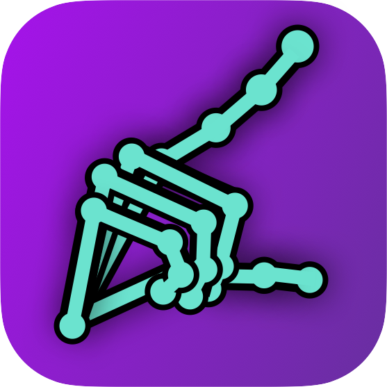

<p align="center">
  
</p>

<h1 align="center">Movement Tracker</h1>

<p align="center">
  <em>A self-hosted web app for video-based fine-motor assessment</em><br>
  for clinical research on <strong>Parkinson's</strong>, <strong>MSA</strong>, <strong>PSP</strong>, essential tremor and related movement disorders.
</p>

<p align="center">
  <a href="https://creativecommons.org/licenses/by-nc/4.0/"></a>
  <a href="#"></a>
  <a href="https://fastapi.tiangolo.com/"></a>
  <a href="https://deeplabcut.github.io/DeepLabCut/"></a>
  <a href="https://mediapipe.dev/"></a>
  <a href="https://doi.org/10.5281/zenodo.19099855"></a>
</p>

<p align="center">
  <a href="#-quick-start">Quick start</a> ·
  <a href="#-features">Features</a> ·
  <a href="#-typical-workflow">Workflow</a> ·
  <a href="#%EF%B8%8F-configuration">Configuration</a> ·
  <a href="#-citation">Citation</a>
</p>

---

## 🚀 Quick start

> **Requirements:** Python 3.9+, macOS or Linux (Windows via WSL or the bundled `run.bat`).

```bash
git clone https://github.com/newboldd/movement-tracker
cd movement-tracker
./setup.sh
```

`setup.sh` creates a virtual environment, installs Python dependencies, downloads the ~24 MB sample video from Zenodo, and opens the app at **http://localhost:8080**.

<table>
  <tr>
    <td>🍎</td>
    <td><strong>macOS</strong> — double-click <code>Movement Tracker.app</code> in the repo (or drag it to your Dock).</td>
  </tr>
  <tr>
    <td>🪟</td>
    <td><strong>Windows</strong> — double-click <code>run.bat</code>. On first launch it auto-creates <code>Movement Tracker.lnk</code> with the hand icon so you can pin it like a normal app.</td>
  </tr>
  <tr>
    <td>🐧</td>
    <td><strong>Linux / WSL</strong> — same as macOS: <code>./setup.sh</code>.</td>
  </tr>
</table>

> 🎓 **Running a workshop?** [`WORKSHOP.md`](WORKSHOP.md) walks through a guided 45-minute session — install → MediaPipe → labeling → bounding-box crop → results. Ideal for lab meetings and onboarding.

---

## ✨ Features

<table>
  <tr>
    <td valign="top" width="50%">
      <h3>👤 Subject management</h3>
      Import raw stereo videos, trim trials, organise by diagnosis group. Face detection runs automatically on import so identifiable faces are blurred before storage.
    </td>
    <td valign="top" width="50%">
      <h3>🖍️ DLC labeling</h3>
      Frame-by-frame keypoint annotation with keyboard shortcuts. Auto-detects movement events (open / peak / close) from the distance trace and renders them on a synchronised timeline.
    </td>
  </tr>
  <tr>
    <td valign="top">
      <h3>✋ MediaPipe prelabels</h3>
      Forward, reverse, static, and bbox-cropped MediaPipe passes are fused into a single <em>Combined</em> layer that the rest of the pipeline reads. Run any source with one click.
    </td>
    <td valign="top">
      <h3>🦴 MANO 3D fit</h3>
      Stereo-triangulated 3-D hand pose; multiple fitting strategies (Stage 1, Fit Legacy, Fit v2) share the Combined-MP layer so improvements propagate everywhere.
    </td>
  </tr>
  <tr>
    <td valign="top">
      <h3>📊 Results</h3>
      Per-trial movement metrics (amplitude, IMI, peak velocities, sequence effect, …), group comparisons, and an Explore tool with scatter/bar plots, hierarchical clustering, and correlation/covariance matrices.
    </td>
    <td valign="top">
      <h3>☁️ Remote GPU</h3>
      Submit MediaPipe / DLC inference to a GPU host over SSH. Videos upload, jobs run remotely, results download — no GPU dependencies needed locally.
    </td>
  </tr>
</table>

---

## 🔁 Typical workflow

```
1. Add Subject    /onboarding
   Browse to source video → trim trials → set hand labels (L1, R1, …)
   Faces blurred and trials saved to your video directory.

2. DLC Labeling   /labeling-select
   Open subject → label keypoints frame-by-frame → auto-detect events.

3. MediaPipe      Processing tab (or auto on import)
   Hand landmarks per trial; combined source layer drives downstream code.

4. MANO Fit       /mano
   Stereo 3-D pose; distance traces computed per trial.

5. Results        /results
   Per-subject + group metrics; static-site export for GitHub-Pages sharing.
```

---

## 🗂️ Sample data

A short finger-tapping example video (<code>Con01_R1.mp4</code>, ~24 MB, stereo) is on Zenodo:

> Newbold, D. (2025). *Finger tapping example* [Data set]. Zenodo. <https://doi.org/10.5281/zenodo.19099855>

Downloaded automatically by `setup.sh`. Manual fetch:

```bash
python scripts/download_sample.py
```

---

## ⚙️ Configuration

Settings live in `movement_tracker/settings.json` (gitignored). Every setting also reads from an environment variable — useful for deployment or CI.

| Setting | Env var | Description |
|---|---|---|
| Video directory | `DLC_APP_VIDEO_DIR` | Root folder containing subject video subfolders |
| DLC directory | `DLC_APP_DLC_DIR` | DeepLabCut project directory |
| Camera names | `DLC_APP_CAMERA_NAMES` | Comma-separated, e.g. `OS,OD` |
| Bodyparts | `DLC_APP_BODYPARTS` | Comma-separated, e.g. `thumb,index` |
| Port | `DLC_APP_PORT` | Default `8080` |
| Remote host | `DLC_APP_REMOTE_HOST` | SSH target, e.g. `user@gpu-server` |
| Remote Python | `DLC_APP_REMOTE_PYTHON` | Remote python binary, e.g. `/home/user/envs/dlc/bin/python` |
| Remote work dir | `DLC_APP_REMOTE_WORK_DIR` | Scratch directory on remote |
| Remote SSH key | `DLC_APP_REMOTE_SSH_KEY` | Optional path to private key |
| Remote SSH port | `DLC_APP_REMOTE_SSH_PORT` | Default `22` |

### Calibration (stereo only)

Place camera calibration YAML files in `calibration/` and set the calibration directory in **Settings**. Two default configurations are included.

---

## 📁 Project layout

```
movement_tracker/       Python / FastAPI package
  app.py                Route registration + startup hooks
  config.py             Settings singleton (JSON + env-var overrides)
  routers/              API endpoints (subjects, labeling, MANO, results, …)
  services/             Business logic (DLC, MediaPipe, MANO, jobs, remote SSH, …)
  static/
    css/main.css        Single stylesheet (dark theme, CSS variables)
    js/                 One module per page — no build step, no framework
    *.html              One HTML file per page
calibration/            Camera calibration YAML files
scripts/                Utility scripts (sample download, static export, …)
setup.sh                One-command setup + launch (macOS / Linux)
run.bat                 Launch script (Windows)
Movement Tracker.app    macOS launcher bundle (custom icon)
icon.ico                Windows icon used by the auto-generated shortcut
```

---

## 🧩 Dependencies

| Layer | Library |
|---|---|
| Web server | [FastAPI](https://fastapi.tiangolo.com/) · [uvicorn](https://www.uvicorn.org/) |
| Pose estimation | [DeepLabCut](https://deeplabcut.github.io/DeepLabCut/) |
| Hand tracking | [MediaPipe](https://mediapipe.dev/) |
| Video / face detection | [OpenCV](https://opencv.org/) |
| Numerics | [NumPy](https://numpy.org/) · [SciPy](https://scipy.org/) |
| Plots (frontend) | [Plotly](https://plotly.com/javascript/) |

Full list in `requirements.txt`; installed automatically by `setup.sh`.

---

## 📚 Citation

If you use this software in published research, please cite it:

```bibtex
@software{newbold_movement_tracker,
  author  = {Newbold, David},
  title   = {Movement Tracker},
  url     = {https://github.com/newboldd/movement-tracker},
  license = {CC-BY-NC-4.0}
}
```

A [`CITATION.cff`](CITATION.cff) file is included so GitHub shows a **Cite this repository** button in the sidebar.

---

## 📜 License

<a href="https://creativecommons.org/licenses/by-nc/4.0/">
  
</a>

[**CC BY-NC 4.0**](https://creativecommons.org/licenses/by-nc/4.0/) — free for academic and non-commercial use. For commercial licensing, please get in touch.

<p align="center">
  <sub>Built for the neurology research bench. Made open so other labs don't reinvent the same wheel.</sub>
</p>
